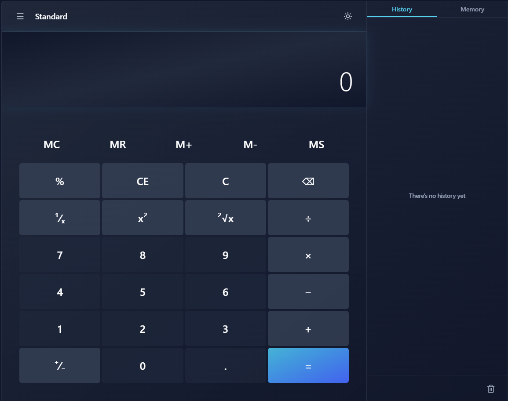
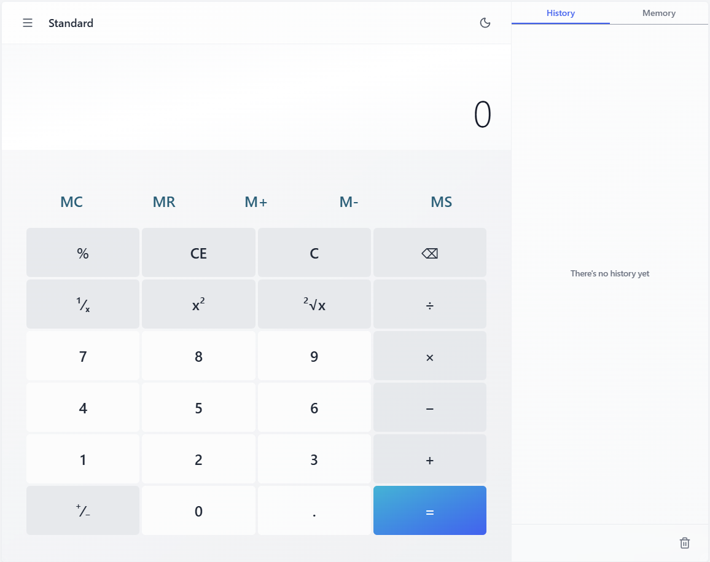

# 🧮 Windows 11 Calculator
Deployment: https://ia02-web-based-calculator.vercel.app/

Một máy tính Windows 11 được tái tạo hoàn hảo với React, có giao diện đẹp và đầy đủ tính năng.





## ✨ Tính năng nổi bật

- 🎨 **Giao diện Windows 11**: Thiết kế pixel-perfect giống hệt máy tính Windows 11
- 🌙 **Chế độ sáng/tối**: Chuyển đổi giữa light mode và dark mode
- 📱 **Responsive**: Hoạt động mượt mà trên cả mobile và desktop
- ⌨️ **Hỗ trợ bàn phím**: Đầy đủ phím tắt và điều hướng bằng bàn phím
- 📊 **Lịch sử tính toán**: Xem và tải lại các phép tính trước đó
- 💾 **Bộ nhớ**: Lưu trữ và quản lý các giá trị trong bộ nhớ
- 🧮 **Tính năng nâng cao**: Căn bậc hai, bình phương, nghịch đảo, phần trăm
- ♿ **Accessibility**: Hỗ trợ screen reader và ARIA labels

## 🚀 Cài đặt và chạy

### Yêu cầu hệ thống

- Node.js 16+
- npm hoặc yarn

### Các bước cài đặt

```bash
# 1. Clone repository
git clone https://github.com/MinhNguyenCG/ia02-web-based-calculator.git
cd ia02-web-based-calculator

# 2. Cài đặt dependencies
npm install

# 3. Chạy ứng dụng
npm run dev
```

Ứng dụng sẽ mở tại `http://localhost:3000`

## 🏗️ Build cho production

```bash
# Build ứng dụng
npm run build

# Xem trước build production
npm run preview
```

## 🧪 Chạy tests

```bash
# Chạy tất cả tests
npm test

# Chạy tests trong chế độ watch
npm run test:watch
```

## ⌨️ Phím tắt

| Phím             | Chức năng        |
| ---------------- | ---------------- |
| `0-9`            | Nhập số          |
| `.`              | Dấu thập phân    |
| `+`              | Phép cộng        |
| `-`              | Phép trừ         |
| `*`              | Phép nhân        |
| `/`              | Phép chia        |
| `Enter` hoặc `=` | Tính toán        |
| `Escape`         | Xóa tất cả (C)   |
| `Delete`         | Xóa entry (CE)   |
| `Backspace`      | Xóa số cuối      |
| `%`              | Phần trăm        |
| `S`              | Căn bậc hai (√)  |
| `X`              | Bình phương (x²) |

## 🏗️ Kiến trúc dự án

### Cấu trúc thư mục

```
src/
├── components/          # React components
│   ├── Display.jsx      # Màn hình hiển thị
│   ├── Keypad.jsx       # Bàn phím số
│   ├── Header.jsx       # Header với menu
│   └── SidePanel.jsx    # Panel lịch sử/bộ nhớ
├── logic/               # Logic xử lý
│   ├── calculatorMachine.js  # State management
│   ├── evaluator.js     # Đánh giá biểu thức
│   ├── decimal.js       # Xử lý số thập phân
│   └── percent.js       # Tính phần trăm
├── hooks/               # Custom hooks
└── __tests__/          # Test files
```

### Quản lý State

Sử dụng React `useReducer` với custom reducer để quản lý:

- Input hiện tại
- Biểu thức toán học
- Lịch sử tính toán
- Bộ nhớ
- Trạng thái lỗi

### Xử lý biểu thức

1. **Tokenization**: Chia biểu thức thành tokens
2. **Shunting Yard Algorithm**: Chuyển đổi từ infix sang postfix
3. **RPN Evaluation**: Tính toán biểu thức postfix

## 🎨 Công nghệ sử dụng

- **React 18**: Framework UI
- **Vite**: Build tool và dev server
- **Tailwind CSS**: Styling
- **Jest**: Testing framework
- **React Testing Library**: Component testing

## 🌐 Hỗ trợ trình duyệt

- Chrome/Edge (phiên bản mới nhất)
- Firefox (phiên bản mới nhất)
- Safari (phiên bản mới nhất)
- Trình duyệt mobile

---

Được xây dựng với ❤️ bằng React và Tailwind CSS
